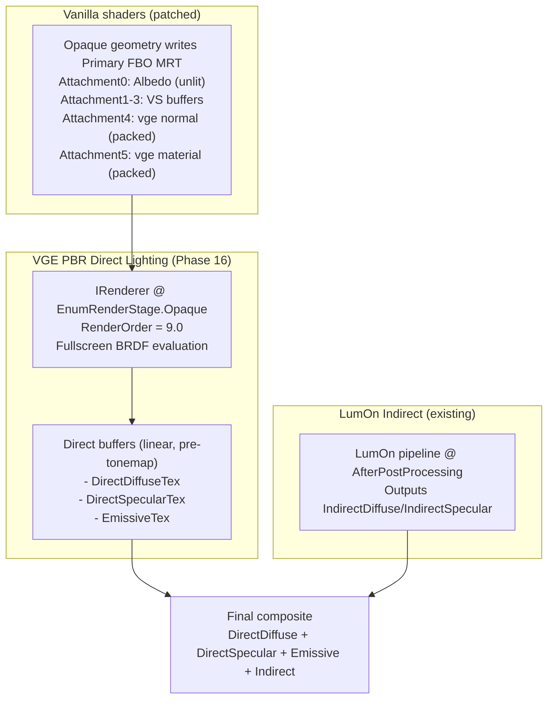

# PBR Direct Lighting Pass System (Phase 16)

> **Document**: LumOn.09-PBR-Direct-Lighting-Pass.md  
> **Status**: Draft  
> **Dependencies**:
>
> - G-buffer contract: [LumOn.01-Core-Architecture.md](LumOn.01-Core-Architecture.md) (GBufferManager integration)
> - LumOn final combine stage: [LumOn.08-Pipeline-Alignment-with-Lumen.md](LumOn.08-Pipeline-Alignment-with-Lumen.md) (Pass 6: Combine)
> - Runtime sources:
>   - `GBufferManager` (Primary FBO attachments 4–5)
>   - `VanillaShaderPatches` (vanilla shader outputs patched to MRT)

---

## 1. Overview

This document defines **Phase 16**: a dedicated **PBR direct-lighting pass system** for VanillaGraphicsExpanded.

In this repo, vanilla world shaders have been patched so they primarily output **material signals** (albedo/normal/material), not final lit color. Phase 16 introduces a new authoritative direct lighting stage that:

- Runs in the **Opaque stage** at **`RenderOrder = 9.0`**
- Evaluates **full metallic/roughness BRDF** from the G-buffer
- Produces a **diffuse/specular split**, plus a **separate emissive buffer**
- Feeds the downstream GI/composite pipeline (LumOn or future systems)

### 1.1 Design goals

| Goal                       | Requirement                                                        |
| -------------------------- | ------------------------------------------------------------------ |
| Replace the pbr-overlay    | Disable the overlay path (code left temporarily, removal soon)     |
| Correct direct lighting    | New pass becomes the authoritative direct lighting producer        |
| Full PBR from day one      | GGX + Smith + Schlick, metallic/roughness workflow                 |
| All light sources in scope | Sun/sky, block/point lights, shadows, fog, etc.                    |
| Split outputs              | `DirectDiffuse`, `DirectSpecular`, `Emissive` are distinct buffers |
| Linear, pre-tonemap        | Buffers must be consistent and stable for GI/composite             |

### 1.2 Non-goals (Phase 16)

- World-space GI / probe systems (belongs to later phases)
- Replacing LumOn itself (LumOn remains indirect)
- Perfect parity with UE5 Lumen (Phase 16 is about direct lighting contract)

---

## 2. Pipeline placement

Phase 16 is implemented as an `IRenderer` registered at:

- **Stage**: `EnumRenderStage.Opaque`
- **Order**: `RenderOrder = 9.0`

**Why this location:**

- Opaque geometry has already populated the Primary framebuffer’s MRT attachments (including VGE’s G-buffer attachments).
- The direct-lighting pass can read the full screen’s G-buffer and produce deterministic lighting buffers.
- This keeps “direct lighting” upstream of GI and avoids coupling direct evaluation with LumOn.

### 2.1 High-level dataflow

---

## 3. Buffer contract

This section is the canonical **data contract** for Phase 16.

### 3.1 Inputs

**Primary framebuffer inputs:**

- **Albedo / base color**: Primary `ColorAttachment0` (existing VS output).

  - Assumption: linear, pre-tonemap content suitable for lighting evaluation.
  - If this assumption changes, Phase 16 must apply the correct decode (documented explicitly in shader).

- **Depth**: Primary depth texture.

- **G-buffer normal**: VGE `ColorAttachment4` from `GBufferManager`.

  - Format: `RGBA16F`.
  - Encoding: `normalPacked = normalWS * 0.5 + 0.5` in XYZ.

- **G-buffer material**: VGE `ColorAttachment5` from `GBufferManager`.
  - Format: `RGBA8`.
  - Channels (normalized 0..1):
    - `R = Roughness`
    - `G = Metallic`
    - `B = Emissive` (scalar mask/intensity)
    - `A = Reflectivity`

**Lighting inputs:**

“All light sources are in scope.” The direct-lighting pass must bind and use the full set of lighting-related uniforms/textures already available in the Vintage Story pipeline (sun/sky, block/point lights, shadows, fog, etc.).

Implementation note: the pass should **reuse the same lighting inputs and helper includes** the vanilla pipeline uses (via the existing shader imports system) to avoid re-deriving light data on the CPU.

### 3.2 Outputs

Phase 16 produces **three** full-screen render targets in linear HDR space:

- **`DirectDiffuseTex`**: direct diffuse radiance only
- **`DirectSpecularTex`**: direct specular radiance only
- **`EmissiveTex`**: emissive radiance only (no direct/indirect)

Recommended formats (subject to alignment with existing buffer conventions):

- `RGB16F` or `RGBA16F` for all three targets.

Key rule: **no tone mapping** occurs in these buffers.

---

## 4. Shading model (full metallic/roughness)

Phase 16 uses a standard metallic/roughness microfacet BRDF:

- **NDF**: GGX / Trowbridge-Reitz
- **Geometry**: Smith (Schlick-GGX)
- **Fresnel**: Schlick
- **Diffuse**: Lambert or Burley (project choice; Lambert acceptable if energy-compensated)

### 4.1 Metallic workflow

Given:

- `baseColor` (albedo)
- `metallic` in [0..1]
- `roughness` in [0..1]

Compute:

- Dielectric F0: `F0_dielectric = 0.04` (or pipeline-defined constant)
- `F0 = mix(F0_dielectric, baseColor, metallic)`

Energy split:

- Specular uses `F0`
- Diffuse is suppressed as metallic increases:
  - `kd = (1 - metallic) * (1 - F)` (F is the Fresnel term)

### 4.2 Diffuse/spec split requirements

- `DirectDiffuseTex` contains only the diffuse BRDF contribution.
- `DirectSpecularTex` contains only the specular BRDF contribution.
- The **sum** of the two is the total direct reflected radiance (before emissive).

### 4.3 Emissive

Emissive is stored separately:

- `EmissiveTex` is written from the material signal `emissive` (and any emissive color source if present).
- Emissive must not be mixed into diffuse/spec buffers.

---

## 5. Fog and atmosphere

Fog is in scope as part of “all light sources.” The direct lighting system must apply fog consistently with the rest of the pipeline.

Two acceptable designs:

1. **Fog in the direct pass**: apply fog to `DirectDiffuse`, `DirectSpecular`, and `Emissive` (preferred if it matches vanilla behavior).
2. **Fog in the final composite**: apply fog once to the summed lighting (direct + emissive + indirect), using depth.

The implementation should choose one and document it explicitly in shader comments and in this doc once finalized.

---

## 6. Integration with LumOn

LumOn remains an **indirect lighting system**.

Contract with Phase 16:

- LumOn consumes direct buffers as inputs for final compositing/debug.
- Disabling LumOn must not affect direct lighting.

Operationally:

- When LumOn is enabled: final composite = `DirectDiffuse + DirectSpecular + Emissive + Indirect`.
- When LumOn is disabled: final composite = `DirectDiffuse + DirectSpecular + Emissive` (indirect treated as 0).

---

## 7. Migration plan (pbr-overlay)

The existing `PBROverlayRenderer` path is **disabled** once Phase 16 is active.

- No migration toggle is required.
- Overlay code is retained temporarily only to support imminent deletion.

---

## 8. Debugging and diagnostics

Phase 16 should expose debug views for:

- `DirectDiffuseTex`
- `DirectSpecularTex`
- `EmissiveTex`
- Optional: `DirectTotal = DirectDiffuse + DirectSpecular` (debug-only view)

Additionally, GPU timing queries should include the new direct pass.

---

## 9. GPU functional tests

Minimum expected GPU tests for Phase 16 (names indicative):

- `DirectLighting_ProducesExpectedLambertForDielectric`
- `DirectLighting_MetallicShiftsEnergyToSpecular`
- `DirectLighting_EmissiveIsSeparateBuffer`
- `DirectLighting_StableUnderCameraMotion`
- `Integration_LumOnDisabled_PassesThroughDirect`

Tests should be deterministic and rely on minimal scenes (single light + known normal/material cases).

---

## 10. Open questions

1. Exact encoding/linearization of `ColorAttachment0` (albedo) for the lighting pass.
2. Exact mapping of “all light sources” to available VS uniforms/textures inside this stage.
3. Whether fog is applied in direct vs composite (choose one for parity and stability).
