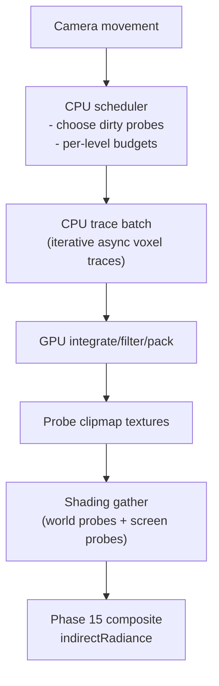

# LumOn World-Space Clipmap Probes (Phase 18 Overview)

> **Document**: LumOn.16-World-Space-Clipmap-Probes.md  
> **Status**: Draft  
> **Dependencies**:
>
> - Core pipeline context: [LumOn.01-Core-Architecture.md](LumOn.01-Core-Architecture.md)
> - Screen-space alignment: [LumOn.08-Pipeline-Alignment-with-Lumen.md](LumOn.08-Pipeline-Alignment-with-Lumen.md)
> - Direct lighting contract: [LumOn.09-PBR-Direct-Lighting-Pass.md](LumOn.09-PBR-Direct-Lighting-Pass.md)

---

## 1. Overview

This document defines the Phase 18 architecture for a world-space, clipmap-based probe system ("world probes"). The goal is to complement the existing screen-space LumOn pipeline with a stable, off-screen lighting source that feeds the same indirect radiance and compositing path.

### 1.1 Motivation vs screen-space probes

Screen-space probes are fast and dense, but they fail when:

- Rays exit the screen
- Geometry is occluded or behind the camera
- Camera motion causes visible disocclusion gaps

World-space clipmap probes address those cases by caching indirect lighting in a camera-centered, multi-resolution volume that persists across frames.

### 1.2 Design goals

| Goal | Requirement |
| --- | --- |
| Stable off-screen GI | Probes persist across frames and camera motion |
| Coexist with LumOn | World probes feed the same indirectRadiance inputs |
| Scalable memory | Clipmap levels trade detail for distance |
| Update within budget | Time-sliced updates with per-level limits |
| Minimal coupling | Separate scheduling from shading and compositing |

### 1.3 Non-goals (Phase 18)

- Full Lumen surface cache replacement
- Perfect parity with UE5 world probes
- Dynamic mesh capture beyond existing G-buffer and scene data
- Final implementation details (this is architecture only)

---

## 2. System scope and terminology

| Term | Meaning |
| --- | --- |
| Clipmap | A stack of nested volumes centered on the camera, each with increasing probe spacing |
| Level | One clipmap volume (L0 is finest, Ln is coarsest) |
| Probe | A cached lighting sample at a world-space grid point |
| Probe payload | SH irradiance + ShortRangeAO direction + confidence (see data layout doc) |
| IndirectRadiance | The shared lighting product consumed by Phase 15 compositing |

---

## 3. Integration strategy

World probes do not replace screen-space LumOn. They provide a second source of indirect lighting:

- Screen-space LumOn produces high-frequency, view-dependent detail.
- World probes provide low-frequency, stable off-screen lighting.
- Shading blends the two using confidence weights (screen-first with fallback).

Fallback behavior:

- If world probes are invalid or missing, rely on screen-space GI or ambient fallback.
- If screen-space confidence is low, rely more on world probes.

The blending occurs in the same indirect compositing path used by Phase 15.

---

## 4. Constraints and performance boundaries

### 4.1 Vintage Story constraints

- World is chunked; terrain and lighting change on chunk boundaries.
- GPU memory is limited; assume a fixed budget for probe textures.
- Update bandwidth must fit within the post-opaque budget.

### 4.2 CPU responsibilities

- Track clipmap origins per level (snapped to spacing)
- Maintain update queues and dirty regions
- Run iterative async voxel traces for scheduled probes
- Issue update batches to GPU

### 4.3 GPU responsibilities

- Integrate/encode probe payload (L1 SH + ShortRangeAO)
- Filter/denoise probe payload
- Expose probe textures for shading

### 4.4 Initial config defaults (Phase 18)

These defaults are for initial bring-up and can be tuned once performance data is available.

| Setting | Default | Notes |
| --- | --- | --- |
| `ClipmapBaseSpacing` | 2.0 | World units between probes at L0 |
| `ClipmapResolution` | 32x32x32 | Per-level probe grid |
| `ClipmapLevels` | 4 | L0-L3 |
| `ProbeUpdateBudgetL0` | 256 | Probes per frame at L0 |
| `ProbeUpdateBudgetFalloff` | `budgetL = baseBudget >> L` | L1=128, L2=64, L3=32 |

### 4.5 Quality + perf targets (bring-up)

These are **initial** targets to guide implementation decisions and prevent the clipmap system from regressing the existing LumOn pipeline.

Quality targets:

- **Stability first**: world probes should reduce view-dependent “black cutoffs” and disocclusion gaps relative to screen-space alone.
- **Diffuse correctness**: L1 SH should provide plausible low-frequency diffuse GI; high-frequency detail remains screen-space.
- **Graceful failure**: missing/low-confidence world probes should never introduce normalization artifacts (no “blow up” when weights are tiny).

Performance + budget targets:

- **Memory**: keep total resident clipmap probe textures under ~8–16 MiB for the default settings.
- **CPU**: scheduling overhead should be negligible; trace work is time-sliced via a strict per-frame probe budget (background threads), with cancellation/backpressure.
- **GPU**: uploads and integrate/resolve should fit within a small, bounded post-opaque budget; enforce an explicit bytes-per-frame upload cap.

Expected update budget shape (per frame):

- L0 receives the majority of updates (near camera), falling off by level (e.g., `baseBudget >> L`).
- Coarser levels update slowly but persist longer; they are primarily a stable fallback.

---

## 5. High-level dataflow

---

## 6. Decisions (locked)

- SH order: L1
- Trace source: iterative async voxel traces on the CPU
- Visibility: ShortRangeAO direction (oct-encoded) + confidence
