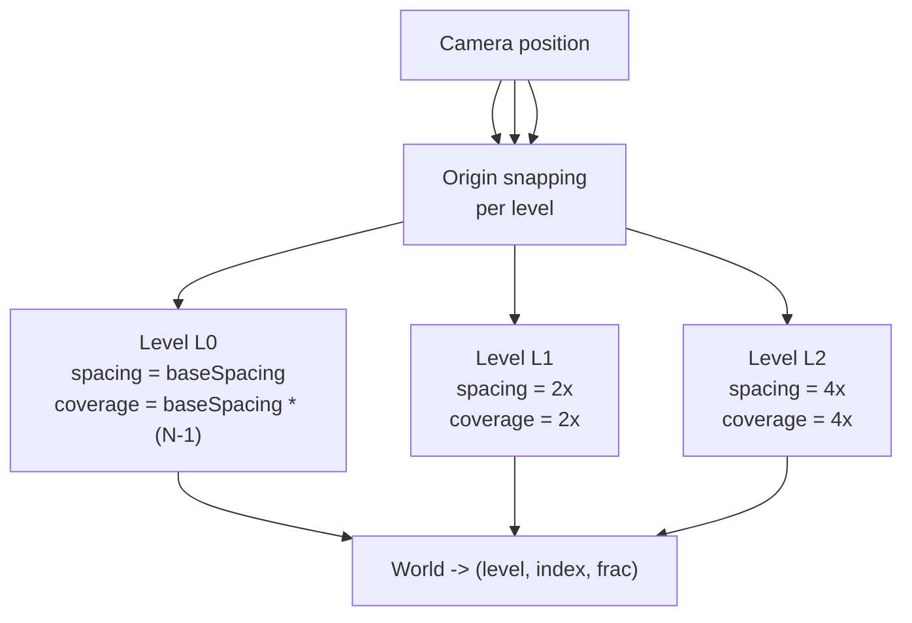

# LumOn Clipmap Topology and Addressing

> **Document**: LumOn.17-Clipmap-Topology-and-Addressing.md  
> **Status**: Draft  
> **Dependencies**:
>
> - Phase 18 overview: [LumOn.16-World-Space-Clipmap-Probes.md](LumOn.16-World-Space-Clipmap-Probes.md)

---

## 1. Overview

This document defines the clipmap topology for world probes and how world-space positions map to probe indices. It establishes the coordinate transforms, origin snapping rules, and cross-level blending behavior.

---

## 2. Clipmap level definition

Each level is a fixed-resolution 3D grid centered on the camera.

- **Base spacing**: `baseSpacing` (world units between probes at L0)
- **Level spacing**: `spacingL = baseSpacing * (2^L)`
- **Resolution**: `resolution = (Nx, Ny, Nz)` (constant across levels)
- **World coverage**: `coverageL = spacingL * (resolution - 1)`

Levels are ordered from finest to coarsest:

- **L0**: highest detail, smallest coverage
- **L1+**: lower detail, larger coverage

---

## 3. Origin snapping and wrapping

To keep probe identity stable while keeping the grid camera-centered, each level uses a snapped **anchor** and derives a camera-centered origin.

```
anchorL = Snap(cameraPos, spacingL)
Snap(p, s) = floor(p / s) * s
```

The clipmap **origin** is the minimum-corner of the level in world space:

```text
originL = anchorL - (resolution/2) * spacingL
```

This places the camera near the middle of the grid (in probe units), while keeping the level stable under camera motion.

The clipmap uses a ring-buffer addressing scheme to avoid reallocating textures when the origin shifts. Indices wrap by `resolution`:

```
indexWrapped = (index % resolution + resolution) % resolution
```

---

## 4. World-to-clipmap addressing

Given a world position, select a level and compute local coordinates:

```
SelectLevel(pos, cameraPos):
    dist = length(pos - cameraPos)
    return clamp(floor(log2(max(dist, baseSpacing) / baseSpacing)), 0, maxLevel)

WorldToClipmap(pos, level):
    spacingL = baseSpacing * (2^level)
  anchorL = Snap(cameraPos, spacingL)
  originL = anchorL - (resolution/2) * spacingL
    local = (pos - originL) / spacingL
    index = floor(local)
    frac = local - index
    return index, frac
```

`index` is used for probe lookup; `frac` is used for trilinear interpolation.

---

## 5. Probe indexing and coordinate transforms

Indexing for a single level uses a 3D integer coordinate:

```
probeIndex = (ix, iy, iz) where ix in [0, Nx-1]
```

For storage in 3D textures, the mapping is direct. For an atlas, a linear index is used:

```
linearIndex = ix + iy * Nx + iz * Nx * Ny
```

Coordinate transforms:

- **World -> Clipmap local**: `(pos - originL) / spacingL`
- **Clipmap local -> World**: `originL + (index + 0.5) * spacingL` (probe center)

---

## 6. Edge behavior and cross-level blending

To reduce seams between levels:

1. Each level has an **overlap band** near its boundary.
2. Samples inside the overlap blend between level L and level L+1.

Suggested blend weight:

```
edgeDist = DistanceToLevelBoundary(local, resolution)
blend = saturate((edgeDist - blendStart) / blendWidth)
value = lerp(sampleLplus1, sampleL, blend)
```

`blendStart` and `blendWidth` are expressed in **probe units** (not world units) so they scale with level spacing.

Implementation note:

- `local` is in probe units.
- `DistanceToLevelBoundary` uses the minimum distance to any face of the level in probe units.

---

## 7. Clipmap topology diagram



---

## 8. Decisions (locked)

- SH order: L1
- Trace source: iterative async voxel traces on the CPU
- Visibility: ShortRangeAO direction (oct-encoded) + confidence
