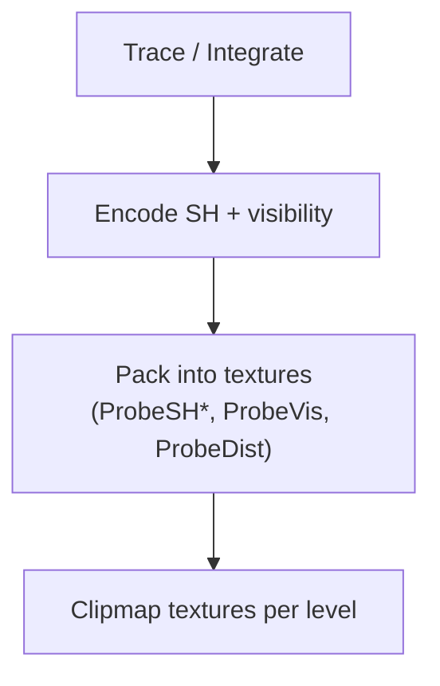

# LumOn Probe Data Layout and Packing

> **Document**: LumOn.18-Probe-Data-Layout-and-Packing.md  
> **Status**: Draft  
> **Dependencies**:
>
> - Phase 18 overview: [LumOn.16-World-Space-Clipmap-Probes.md](LumOn.16-World-Space-Clipmap-Probes.md)
> - Clipmap topology: [LumOn.17-Clipmap-Topology-and-Addressing.md](LumOn.17-Clipmap-Topology-and-Addressing.md)

---

## 1. Overview

This document defines the initial probe payload and how it is packed into GPU textures. The layout is expected to evolve, so the versioning strategy is included.

---

## 2. Probe payload (initial scope)

Each probe stores the minimum data needed for stable indirect lighting:

- **Irradiance** in low-order SH (L1)
- **Visibility / directional occlusion** (ShortRangeAO direction, oct-encoded)
- **Hit distance** (mean or log distance) for confidence and filtering
- **Confidence** scalar (0..1)

Optional future fields:

- **Variance / moments** for temporal clamping
- **Validity / flags** (bitfield for probe state)

---

## 3. Encoding choices

### 3.1 SH order

| SH order | Coefficients per color | Total floats | Notes |
| --- | --- | --- | --- |
| L1 (SH4) | 4 | 12 | Lowest cost, good for diffuse |
| L2 (SH9) | 9 | 27 | Higher quality, higher memory |

Decision: L1 is the baseline for initial implementation; L2 is a future upgrade.

### 3.2 ShortRangeAO representation

Chosen for initial implementation:

- **ShortRangeAO direction** (oct-encoded unit vector) + confidence

Alternative options (future):

- **Cone angle + direction** (oct-encoded direction + scalar angle)
- **Scalar visibility** (single occlusion factor)

### 3.3 Hit distance

Use a **log-encoded mean distance** to stabilize large ranges:

```
logDist = log2(max(dist, minDist))
```

Optionally store variance if temporal filters need it.

---

## 4. Texture layout options

### 4.1 Baseline layout (L1 SH, packed)

Pack 12 floats into 3 RGBA16F textures per level:

| Texture | Channels | Content |
| --- | --- | --- |
| `ProbeSH0` | RGBA | c0.r, c0.g, c0.b, c1.r |
| `ProbeSH1` | RGBA | c1.g, c1.b, c2.r, c2.g |
| `ProbeSH2` | RGBA | c2.b, c3.r, c3.g, c3.b |

Visibility and confidence:

| Texture | Channels | Content |
| --- | --- | --- |
| `ProbeVis0` | RGBA16F | octX, octY, reserved, confidence |

The third channel is reserved for a future cone angle or scalar visibility value.

Hit distance:

| Texture | Channels | Content |
| --- | --- | --- |
| `ProbeDist0` | RG16F | meanLogDist, variance (optional) |

### 4.2 L2 layout (higher quality)

L2 SH requires 27 floats, packed into 7 RGBA16F textures (1 float unused):

```
ProbeSH0..ProbeSH6 (RGBA16F each)
```

The channel-to-coefficient mapping is a simple linear packing table stored in shader constants.

### 4.3 Atlas vs 3D textures

Two storage options are supported by the architecture:

- **3D textures** per level (direct indexing, simple addressing)
- **2D atlases** per level (easier to update by tiles, more flexible)

The addressing math from LumOn.17 applies to both.

---

## 5. Memory budget math

Total memory per level:

```
bytesPerProbe = sum(textureBytesPerProbe)
bytesPerLevel = Nx * Ny * Nz * bytesPerProbe
totalBytes = sum(bytesPerLevel for all levels)
```

Example (L1 layout, 3 SH textures + vis + dist):

- 3x RGBA16F + 1x RGBA16F + 1x RG16F = 4x RGBA16F + 1x RG16F
- bytesPerProbe = 4 * 8 + 1 * 4 = 36 bytes

This rough math drives level count and resolution decisions.

---

## 6. Versioning strategy

Probe layouts evolve. To keep compatibility:

- Add a `ProbeLayoutVersion` integer in renderer constants.
- Increment when channel mappings change.
- On version mismatch, clear probe textures and rebuild.

Optional: store the version in a CPU-side cache header if persistence is added.

---

## 7. Packing diagram



---

## 8. Decisions (locked)

- SH order: L1
- Trace source: iterative async voxel traces on the CPU
- Visibility: ShortRangeAO direction (oct-encoded) + confidence
