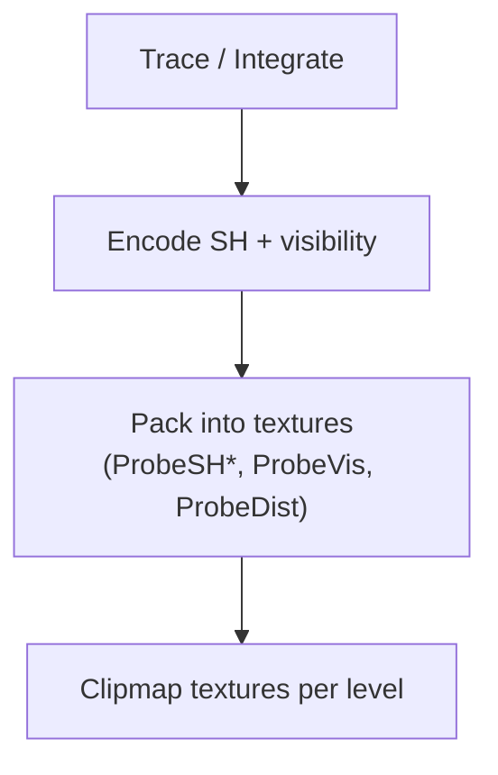

# LumOn Probe Data Layout and Packing

> **Document**: LumOn.18-Probe-Data-Layout-and-Packing.md  
> **Status**: Draft  
> **Dependencies**:
>
> - Phase 18 overview: [LumOn.16-World-Space-Clipmap-Probes.md](LumOn.16-World-Space-Clipmap-Probes.md)
> - Clipmap topology: [LumOn.17-Clipmap-Topology-and-Addressing.md](LumOn.17-Clipmap-Topology-and-Addressing.md)

---

## 1. Overview

This document defines the initial probe payload and how it is packed into GPU textures. The layout is expected to evolve, so the versioning strategy is included.

---

## 2. Probe payload (initial scope)

Each probe stores the minimum data needed for stable indirect lighting:

- **Irradiance** in low-order SH (L1)
- **Visibility / directional occlusion** (ShortRangeAO direction, oct-encoded)
- **Hit distance** (mean or log distance) for confidence and filtering
- **Confidence** scalar (0..1)

Optional future fields:

- **Variance / moments** for temporal clamping
- **Validity / flags** (bitfield for probe state)

---

## 3. Encoding choices

### 3.1 SH order

| SH order | Coefficients per color | Total floats | Notes                         |
| -------- | ---------------------- | ------------ | ----------------------------- |
| L1 (SH4) | 4                      | 12           | Lowest cost, good for diffuse |
| L2 (SH9) | 9                      | 27           | Higher quality, higher memory |

Decision: L1 is the baseline for initial implementation; L2 is a future upgrade.

### 3.2 SH basis conventions (L1)

World probes reuse the **same real SH basis and coefficient ordering as screen-space LumOn** (see `assets/.../includes/lumon_sh.glsl`).

**Direction space**

- SH is defined over **world-space unit directions** $\omega$.
- Coefficients are stored in **world space**; no SH rotation is performed on camera rotation.

**Real SH basis (normalized)**

We store 4 coefficients per color channel:

- $c_0$ = $\int L(\omega)\,Y_{00}(\omega)\,d\omega$
- $c_1$ = $\int L(\omega)\,Y_{1,-1}(\omega)\,d\omega$ (mapped to **$y$**)
- $c_2$ = $\int L(\omega)\,Y_{1,0}(\omega)\,d\omega$ (mapped to **$z$**)
- $c_3$ = $\int L(\omega)\,Y_{1,1}(\omega)\,d\omega$ (mapped to **$x$**)

With constants:

- $Y_{00} = 0.282095$
- $Y_{1,-1} = 0.488603\,y$
- $Y_{1,0} = 0.488603\,z$
- $Y_{1,1} = 0.488603\,x$

So the coefficient vector for each channel is:

```text
sh = vec4(c0, cY, cZ, cX)
```

**Diffuse convolution**

For Lambertian outgoing diffuse, we apply the cosine-kernel band weights matching `lumon_sh.glsl`:

- $A_0 = \pi$
- $A_1 = \tfrac{2\pi}{3}$

and return $E/\pi$.

### 3.3 ShortRangeAO representation

Chosen for initial implementation:

- **ShortRangeAO direction** (oct-encoded unit vector) + confidence

Alternative options (future):

- **Cone angle + direction** (oct-encoded direction + scalar angle)
- **Scalar visibility** (single occlusion factor)

### 3.3 Hit distance

Use a **log-encoded mean distance** to stabilize large ranges.

For consistency with existing LumOn hit-distance encoding helpers (`lumon_octahedral.glsl`), use:

```text
encoded = log(dist + 1)
```

Optionally store variance if temporal filters need it.

---

## 4. Texture layout options

### 4.1 Baseline layout (L1 SH, packed)

Pack 12 floats into **3 RGBA16F** textures per level (**full-fidelity**, no compression):

| Texture    | Channels | Content                |
| ---------- | -------- | ---------------------- |
| `ProbeSH0` | RGBA     | c0.r, c0.g, c0.b, c1.r |
| `ProbeSH1` | RGBA     | c1.g, c1.b, c2.r, c2.g |
| `ProbeSH2` | RGBA     | c2.b, c3.r, c3.g, c3.b |

Visibility and confidence:

| Texture     | Channels | Content                                      |
| ----------- | -------- | -------------------------------------------- |
| `ProbeVis0` | RGBA16F  | octU, octV, skyIntensity, shortRangeAOConfidence |

The `skyIntensity` channel is a per-probe scalar used to decouple sky visibility (stored in `ProbeSky0`) from sky intensity
when evaluating sky contribution in shaders.

Hit distance:

| Texture      | Channels | Content                                       |
| ------------ | -------- | --------------------------------------------- |
| `ProbeDist0` | RG16F    | meanLogDist (log(dist+1)), varianceOrReserved |

Metadata (validity/state flags + unified confidence):

| Texture      | Channels | Content                            |
| ------------ | -------- | ---------------------------------- |
| `ProbeMeta0` | RG32F    | confidence, uintBitsToFloat(flags) |

This matches existing patterns used by the screen-probe atlas meta textures.

### 4.2 L2 layout (higher quality)

L2 SH requires 27 floats, packed into 7 RGBA16F textures (1 float unused):

```
ProbeSH0..ProbeSH6 (RGBA16F each)
```

The channel-to-coefficient mapping is a simple linear packing table stored in shader constants.

### 4.3 Atlas vs 3D textures

Two storage options are supported by the architecture:

- **3D textures** per level (direct indexing, simple addressing)
- **2D atlases** per level (easier to update by tiles, more flexible)

The addressing math from LumOn.17 applies to both.

---

## 5. Memory budget math

Total memory per level:

```
bytesPerProbe = sum(textureBytesPerProbe)
bytesPerLevel = Nx * Ny * Nz * bytesPerProbe
totalBytes = sum(bytesPerLevel for all levels)
```

Example (L1 layout, 3 SH textures + vis + dist):

- 3x RGBA16F + 1x RGBA16F + 1x RG16F = 4x RGBA16F + 1x RG16F
- bytesPerProbe = 4 _ 8 + 1 _ 4 = 36 bytes

Example (Phase 18 defaults):

- resolution = 32x32x32, levels = 4, bytesPerProbe = 36 bytes
- bytesPerLevel = 32 _ 32 _ 32 \* 36 = 1,179,648 bytes (~1.13 MiB)
- totalBytes (4 levels) ~= 4.5 MiB, excluding temporary filter buffers

This rough math drives level count and resolution decisions.

---

## 6. Versioning strategy

Probe layouts evolve. To keep compatibility:

- Add a `WorldProbeLayoutVersion` integer in renderer constants.
- Increment when channel mappings change.
- On version mismatch, clear probe textures and rebuild.

Note: world-probe payloads are not persisted to disk; the version exists to safely invalidate in-memory resources.

---

## 7. Packing diagram



---

## 8. Decisions (locked)

- SH order: L1
- Trace source: iterative async voxel traces on the CPU
- Visibility: ShortRangeAO direction (oct-encoded) + confidence

---

## 9. Metadata + confidence semantics (initial)

### 9.1 Confidence

`confidence` is a **unified probe validity/warm-up scalar** used by shading blend:

- Range: $[0,1]$
- `0` means **uninitialized/invalid** (do not contribute)
- `1` means **fully converged for the current layout/topology**

Shading should treat `confidence` as the _primary_ weight for world probes (screen-first blend is handled in LumOn.21).

### 9.2 Flags (bitfield)

Flags are stored as a `uint` packed via `uintBitsToFloat(flags)` into `ProbeMeta0.g`.

Initial bits:

- `VALID` (probe payload is usable; implies `confidence > 0`)
- `SKY_ONLY` (trace found no meaningful geometry; SH mostly represents sky/ambient)
- `STALE` (payload is valid but scheduled for refresh)
- `IN_FLIGHT` (update job is running; use current payload but avoid marking it “fresh”)

These flags are primarily for debug tooling and scheduling; shading should only hard-reject on `VALID==0`.
