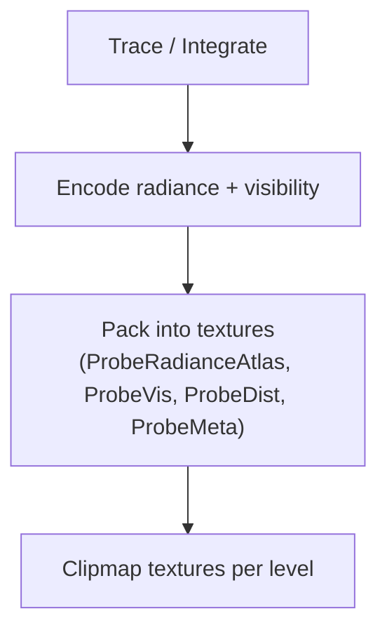

# LumOn Probe Data Layout and Packing

> **Document**: LumOn.18-Probe-Data-Layout-and-Packing.md  
> **Status**: Draft  
> **Dependencies**:
>
> - Phase 18 overview: [LumOn.16-World-Space-Clipmap-Probes.md](LumOn.16-World-Space-Clipmap-Probes.md)
> - Clipmap topology: [LumOn.17-Clipmap-Topology-and-Addressing.md](LumOn.17-Clipmap-Topology-and-Addressing.md)

---

## 1. Overview

This document defines the initial probe payload and how it is packed into GPU textures. The layout is expected to evolve, so the versioning strategy is included.

---

## 2. Probe payload (initial scope)

Each probe stores the minimum data needed for stable indirect lighting:

- **Directional radiance** in an octahedral-mapped per-probe tile (radiance atlas)
- **Visibility / directional occlusion** (ShortRangeAO direction, oct-encoded)
- **Hit distance** (signed log distance) for sky-vs-hit and filtering
- **Confidence** scalar (0..1)

Optional future fields:

- **Variance / moments** for temporal clamping
- **Validity / flags** (bitfield for probe state)

---

## 3. Encoding choices

### 3.1 World-probe radiance atlas encoding

World-probe radiance is stored as an **octahedral-mapped S×S tile per probe**, packed into a single atlas texture.

- Mapping helpers: `assets/vanillagraphicsexpanded/shaders/includes/lumon_worldprobe_atlas.glsl`
- Sampling helper: `assets/vanillagraphicsexpanded/shaders/includes/lumon_worldprobe.glsl`

Each radiance atlas texel stores:

- **RGB**: non-negative radiance (linear)
- **A**: signed log hit distance
  - `+log(dist + 1)` for a scene hit
  - `-log(dist + 1)` for a sky miss

This gives shaders an inexpensive **sky-vs-hit** test and a stable distance signal for filtering.

### 3.3 ShortRangeAO representation

Chosen for initial implementation:

- **ShortRangeAO direction** (oct-encoded unit vector) + confidence

Alternative options (future):

- **Cone angle + direction** (oct-encoded direction + scalar angle)
- **Scalar visibility** (single occlusion factor)

### 3.3 Hit distance

Use a **log-encoded mean distance** to stabilize large ranges.

For consistency with existing LumOn hit-distance encoding helpers (`lumon_octahedral.glsl`), use:

```text
encoded = log(dist + 1)
```

Optionally store variance if temporal filters need it.

---

## 4. Texture layout options

### 4.1 World-Probe Radiance Atlas

Radiance atlas (directional cache):

| Texture              | Format  | Content                            |
| -------------------- | ------- | ---------------------------------- |
| `ProbeRadianceAtlas` | RGBA16F | RGB=radiance, A=signed log(dist+1) |

Shape:

- Clipmap atlas (probe scalars): width = `resolution * resolution`, height = `resolution * levels`
- Radiance atlas: width = `(resolution * resolution) * S`, height = `(resolution * levels) * S`

Where `S` is the per-probe octahedral tile size (`WorldProbeClipmap.OctahedralTileSize`).

Visibility and confidence:

| Texture     | Channels | Content                                          |
| ----------- | -------- | ------------------------------------------------ |
| `ProbeVis0` | RGBA16F  | octU, octV, skyIntensity, shortRangeAOConfidence |

The `skyIntensity` channel is a per-probe scalar used to decouple sky visibility (derived from signed-alpha samples) from sky intensity
when evaluating sky contribution in shaders.

Hit distance:

| Texture      | Channels | Content                                       |
| ------------ | -------- | --------------------------------------------- |
| `ProbeDist0` | RG16F    | meanLogDist (log(dist+1)), varianceOrReserved |

Metadata (validity/state flags + unified confidence):

| Texture      | Channels | Content                            |
| ------------ | -------- | ---------------------------------- |
| `ProbeMeta0` | RG32F    | confidence, uintBitsToFloat(flags) |

This matches existing patterns used by the screen-probe atlas meta textures.

### 4.3 Atlas vs 3D textures

Two storage options are supported by the architecture:

- **3D textures** per level (direct indexing, simple addressing)
- **2D atlases** per level (easier to update by tiles, more flexible)

The addressing math from LumOn.17 applies to both.

---

## 5. Memory budget math

World-probes store a 3D grid per level, flattened into 2D atlases:

- Probe count per level: `resolution^3`
- Probe count total: `resolution^3 * levels`

Total memory (all levels):

```
probeCount = resolution^3 * levels

bytesScalarAtlases = probeCount * (bytesVis0 + bytesDist0 + bytesMeta0 + bytesDebugState0)
bytesRadianceAtlas = probeCount * (S^2) * bytesRgba16f

totalBytes = bytesScalarAtlases + bytesRadianceAtlas
```

Reference bytes/texel:

- `RGBA16F` = 8 bytes
- `RG16F` = 4 bytes
- `RG32F` = 8 bytes
- `RGBA16` (UNorm) = 8 bytes

So, per-probe scalar bytes are typically:

- `ProbeVis0` (RGBA16F): 8 bytes
- `ProbeDist0` (RG16F): 4 bytes
- `ProbeMeta0` (RG32F): 8 bytes
- `ProbeDebugState0` (RGBA16): 8 bytes
- Total scalars: 28 bytes per probe

This rough math drives level count and resolution decisions.

---

## 6. Versioning strategy

Probe layouts evolve. To keep compatibility:

- Add a `WorldProbeLayoutVersion` integer in renderer constants.
- Increment when channel mappings change.
- On version mismatch, clear probe textures and rebuild.

Note: world-probe payloads are not persisted to disk; the version exists to safely invalidate in-memory resources.

---

## 7. Packing diagram



---

## 8. Decisions (locked)

- Trace source: iterative async voxel traces on the CPU
- Visibility: ShortRangeAO direction (oct-encoded) + confidence

---

## 9. Metadata + confidence semantics (initial)

### 9.1 Confidence

`confidence` is a **unified probe validity/warm-up scalar** used by shading blend:

- Range: $[0,1]$
- `0` means **uninitialized/invalid** (do not contribute)
- `1` means **fully converged for the current layout/topology**

Shading should treat `confidence` as the _primary_ weight for world probes (screen-first blend is handled in LumOn.21).

### 9.2 Flags (bitfield)

Flags are stored as a `uint` packed via `uintBitsToFloat(flags)` into `ProbeMeta0.g`.

Initial bits:

- `VALID` (probe payload is usable; implies `confidence > 0`)
- `SKY_ONLY` (trace found no meaningful geometry; SH mostly represents sky/ambient)
- `STALE` (payload is valid but scheduled for refresh)
- `IN_FLIGHT` (update job is running; use current payload but avoid marking it “fresh”)

These flags are primarily for debug tooling and scheduling; shading should only hard-reject on `VALID==0`.
