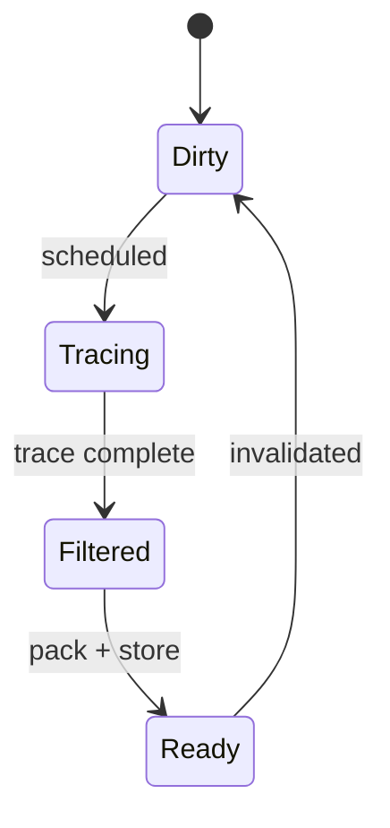

# LumOn Update Pipeline and Scheduling

> **Document**: LumOn.19-Update-Pipeline-and-Scheduling.md  
> **Status**: Draft  
> **Dependencies**:
>
> - Phase 18 overview: [LumOn.16-World-Space-Clipmap-Probes.md](LumOn.16-World-Space-Clipmap-Probes.md)
> - Clipmap topology: [LumOn.17-Clipmap-Topology-and-Addressing.md](LumOn.17-Clipmap-Topology-and-Addressing.md)
> - Probe layout: [LumOn.18-Probe-Data-Layout-and-Packing.md](LumOn.18-Probe-Data-Layout-and-Packing.md)

---

## 1. Overview

This document defines how probe updates are scheduled and executed. It covers update triggers, per-level budgets, and the GPU pipeline for tracing, filtering, and storing probe data.

---

## 2. Update triggers

Probes are marked dirty when:

- Camera moves beyond a threshold for a level
- Lighting changes (time of day, weather, dynamic lights)
- Chunks are loaded/unloaded or block updates occur
- Manual debug actions request a refresh

Dirty marking is level-aware and region-based to avoid global invalidations.

---

## 3. Scheduling policy

### 3.1 Per-level budgets

Each frame has a fixed update budget per level:

```
budgetL = baseBudget >> L
```

L0 updates most frequently; higher levels update less often.

### 3.2 Probe selection

Priority order:

1. Near-camera probes (lowest levels)
2. Dirty regions within visible frustum
3. Oldest timestamps (stale probes)

Selection produces a compact list of probe indices per level.

### 3.3 Determinism and stability

To avoid temporal “sparkle” from scheduling jitter, the scheduler must be deterministic for a given camera path and config:

- Origin snapping per level is deterministic (see LumOn.17).
- Within a level, selection is stable using a strict ordering:
    1) lifecycle priority (dirty/uninitialized first, then stale)
    2) distance to the camera in probe units
    3) stable linear index tiebreak

This makes update ordering independent of hash iteration order, thread timing, or container traversal.

---

## 4. Update pipeline (CPU + GPU)

A minimal update pipeline:

1. Build the probe list for this frame on the CPU.
2. Run iterative async voxel traces on the CPU for the selected probes.
3. Upload trace results + probe indices to GPU (SSBO or texture buffer).
4. Integrate and encode SH + ShortRangeAO + confidence.
5. Apply probe-space filtering.
6. Write into clipmap textures (ring-buffer addressing).

Pseudocode:

```
UpdateProbes(level, probeList):
    for probe in probeList:
        trace = CpuTraceProbe(probe)
        sh = IntegrateSH(trace)
        shortRangeAO = ComputeShortRangeAO(trace)
        filtered = FilterProbe(sh, shortRangeAO)
        StoreProbe(level, probe, filtered)
```

### 4.1 CPU trace output payload (SSBO layout)

The CPU writes a per-level trace batch to two SSBOs. Layout uses `std430` and is sized for variable ray counts per probe.

```glsl
layout(std430, binding = 0) buffer ProbeTraceHeaderBuffer
{
    TraceBatchHeader header;
    ProbeTraceHeader probes[];
};

layout(std430, binding = 1) buffer ProbeTraceSampleBuffer
{
    ProbeTraceSample samples[];
};

struct TraceBatchHeader
{
    uint probeCount;
    uint sampleCount;
    uint level;
    uint reserved;
};

struct ProbeTraceHeader
{
    uint probeIndex;
    uint rayOffset;
    uint rayCount;
    uint flags;
};

struct ProbeTraceSample
{
    vec4 dirDistHit;
    vec4 radianceWeight;
};
```

Field definitions:

- `probeIndex`: linear index for the target clipmap level (see LumOn.17).
- `rayOffset`/`rayCount`: range into `samples[]` for this probe.
- `dirDistHit`: `dirOct.x`, `dirOct.y`, `hitDistance`, `hitMask` (1 = hit, 0 = miss).
- `radianceWeight`: `radiance.rgb` (linear), `weight` (default 1.0).

ShortRangeAO uses the sample directions with `hitMask == 0` (unoccluded) and weights by `weight`. If a ray misses, `hitDistance` should be 0 and `radiance` may be the sky/ambient fallback.

---

## 5. Temporal stabilization rules

When updating a probe:

- Blend with history based on confidence.
- Reject history on large depth or visibility changes.
- Clamp SH coefficients to avoid spikes.

Probes not updated this frame keep their previous payload.

---

## 6. Dynamic geometry and lighting

Dynamic inputs require targeted invalidation:

- Track dirty regions from chunk updates.
- For dynamic lights, mark a radius of probes dirty.
- For moving entities, either ignore (Phase 18) or use a limited invalidation radius.

---

## 7. Update state machine



---

## 8. Decisions (locked)

- SH order: L1
- Trace source: iterative async voxel traces on the CPU
- Visibility: ShortRangeAO direction (oct-encoded) + confidence
