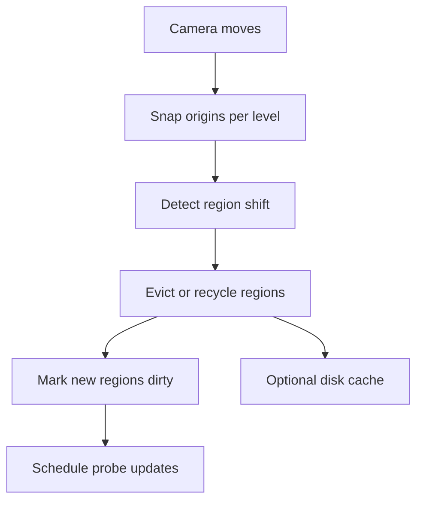

# LumOn Streaming and Persistence

> **Document**: LumOn.20-Streaming-and-Persistence.md  
> **Status**: Draft  
> **Dependencies**:
>
> - Phase 18 overview: [LumOn.16-World-Space-Clipmap-Probes.md](LumOn.16-World-Space-Clipmap-Probes.md)
> - Clipmap topology: [LumOn.17-Clipmap-Topology-and-Addressing.md](LumOn.17-Clipmap-Topology-and-Addressing.md)

---

## 1. Overview

This document defines how world-probe data streams as the clipmap origin shifts and how (or whether) probe data persists across sessions.

---

## 2. CPU-side cache

The CPU tracks regions of probe data to support streaming:

- **Key**: `(level, regionCoord)` where `regionCoord` is snapped in world space
- **Value**: Probe payloads for that region (or a handle to GPU data)
- **Metadata**: lastUpdated, dirtyFlags, layoutVersion

Region size should align with the clipmap resolution to simplify reuse.

---

## 3. Eviction and reuse

When the clipmap origin shifts:

1. Identify regions that are now out of range.
2. Evict or recycle their slots.
3. Mark new regions as dirty.

Recommended policy:

- **Near levels**: always refresh on entry.
- **Far levels**: reuse until explicitly invalidated.

---

## 4. Persistence across sessions

Persistence is optional and can be added later.

If enabled:

- Store probe regions to disk keyed by world seed and layout version.
- On load, only accept cached data if version matches.
- Keep a size cap and LRU eviction policy.

Persistence should never block the render thread.

---

## 5. Determinism requirements

To keep results stable:

- Origin snapping must be deterministic for a given camera path.
- Probe update selection should be stable when budgets are equal.
- Cross-session cache invalidation must be deterministic (version + world seed).

---

## 6. Streaming diagram

---

## 7. Decisions (locked)

- SH order: L1
- Trace source: iterative async voxel traces on the CPU
- Visibility: ShortRangeAO direction (oct-encoded) + confidence
