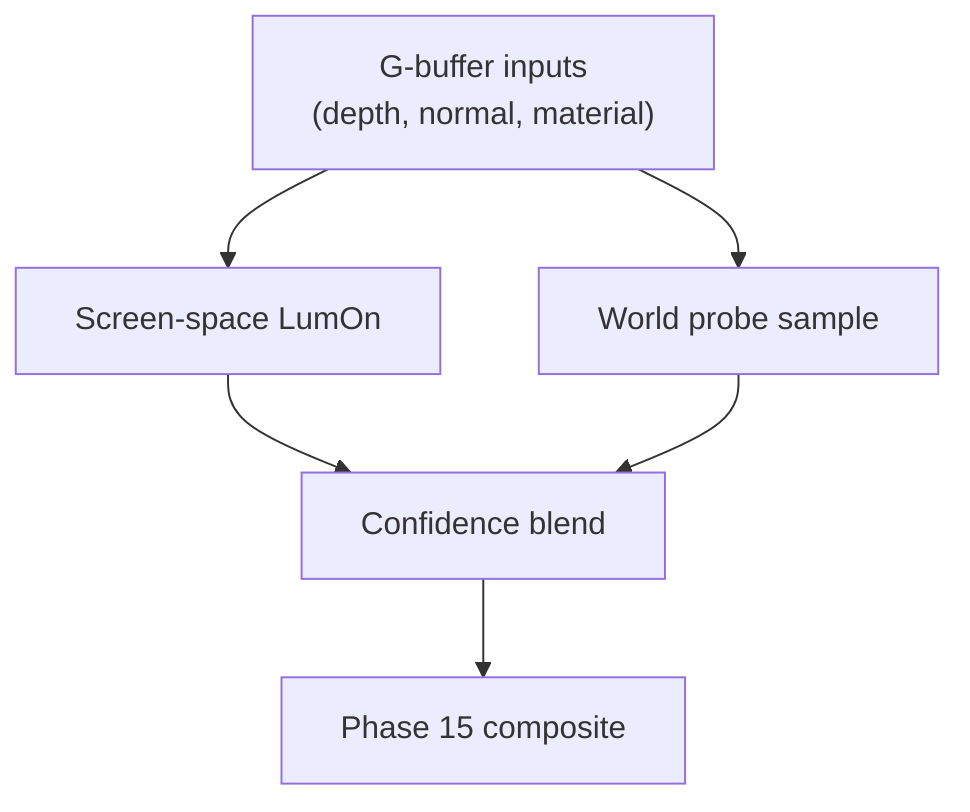

# LumOn Shading Integration (World Probes)

> **Document**: LumOn.21-Shading-Integration.md  
> **Status**: Draft  
> **Dependencies**:
>
> - Phase 18 overview: [LumOn.16-World-Space-Clipmap-Probes.md](LumOn.16-World-Space-Clipmap-Probes.md)
> - Clipmap topology: [LumOn.17-Clipmap-Topology-and-Addressing.md](LumOn.17-Clipmap-Topology-and-Addressing.md)
> - Probe layout: [LumOn.18-Probe-Data-Layout-and-Packing.md](LumOn.18-Probe-Data-Layout-and-Packing.md)
> - Phase 15 composite: [LumOn.08-Pipeline-Alignment-with-Lumen.md](LumOn.08-Pipeline-Alignment-with-Lumen.md) (Pass 6: Combine)

---

## 1. Overview

This document defines how world-probe data is sampled and blended with screen-space GI, then fed into the Phase 15 compositing stage.

---

## 2. Sampling world probes

### 2.1 Level selection

Select a level based on distance or sample footprint:

```
level = SelectLevel(worldPos, cameraPos)
```

Optionally sample both L and L+1 in overlap regions (see LumOn.17).

### 2.2 Trilinear probe sampling

Given `(index, frac)` for a level:

```
sample = Trilinear(ProbeTex, index, frac)
```

For SH payloads:

```
irradiance = EvaluateSH(sampleSH, normalWS)
```

### 2.3 Normal-based weighting

To reduce light leaking:

- Use the ShortRangeAO direction and confidence from the probe payload.
- Apply a normal-based weight:

```
weight = saturate(dot(normalWS, shortRangeAODirWS)) * shortRangeAOConfidence
```

This treats ShortRangeAO as a directional occlusion weight; no cone angle is used in the initial implementation.

---

## 3. Combining with screen-space GI

Screen-space remains the primary source when confident:

```
screenWeight = screenConfidence
worldWeight = worldConfidence * (1 - screenWeight)
norm = max(screenWeight + worldWeight, 1e-4)
indirect = (screenGI * screenWeight + worldGI * worldWeight) / norm
```

Fallback rules:

- If screenConfidence is low or missing, world probes dominate.
- If worldConfidence is low, rely on screen-space or ambient.

---

## 4. Feeding Phase 15 compositing

The blended indirect output feeds the same compositing inputs:

- **IndirectDiffuse** (RGB)
- **IndirectSpecular** (optional, if stored in probes later)
- **ShortRangeAO / visibility** (optional, for AO/contact-occlusion use)

Phase 15 should treat world-probe inputs as interchangeable with screen-probe inputs.

---

## 5. Debugging and tuning

Recommended debug views:

- World probe irradiance only
- Screen-space irradiance only
- Blend weight heatmap (screen vs world)
- Probe confidence

---

## 6. Shading integration diagram



---

## 7. Decisions (locked)

- SH order: L1
- Trace source: iterative async voxel traces on the CPU
- Visibility: ShortRangeAO direction (oct-encoded) + confidence
