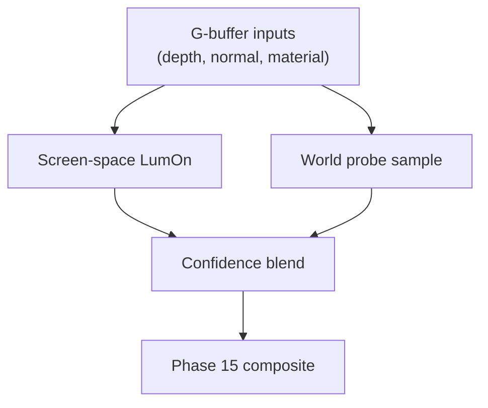

# LumOn Shading Integration (World Probes)

> **Document**: LumOn.21-Shading-Integration.md  
> **Status**: Draft  
> **Dependencies**:
>
> - Phase 18 overview: [LumOn.16-World-Space-Clipmap-Probes.md](LumOn.16-World-Space-Clipmap-Probes.md)
> - Clipmap topology: [LumOn.17-Clipmap-Topology-and-Addressing.md](LumOn.17-Clipmap-Topology-and-Addressing.md)
> - Probe layout: [LumOn.18-Probe-Data-Layout-and-Packing.md](LumOn.18-Probe-Data-Layout-and-Packing.md)
> - Phase 15 composite: [LumOn.08-Pipeline-Alignment-with-Lumen.md](LumOn.08-Pipeline-Alignment-with-Lumen.md) (Pass 6: Combine)

---

## 1. Overview

This document defines how world-probe data is sampled and blended with screen-space GI, then fed into the Phase 15 compositing stage.

### 1.1 Phase 15 indirect contract (per-pixel outputs)

The **Phase 15 composite** consumes a single, unified “indirect lighting product” produced by upstream GI systems (screen-space LumOn and/or world probes).

Required outputs per pixel (initial scope):

- **IndirectDiffuse**: `RGB` linear radiance, pre-tonemap, fog-free.

Optional outputs per pixel (needed for Phase 18+ feature completeness and tuning/debug):

- **IndirectConfidence**: `scalar` $[0,1]$, “how trustworthy is IndirectDiffuse?”.
- **ShortRangeAO direction**: `unit vec3` in **world space** (WS). Provides a _visibility / bent-normal_ style signal.
- **ShortRangeAO confidence**: `scalar` $[0,1]$.
- **Mean hit distance**: `scalar` (world units or log-encoded), used for temporal validation and filtering.

Notes:

- Today’s runtime composite shaders only require `IndirectDiffuse` (see `pbr_composite.*`). The remaining signals are treated as “GI metadata” for later wiring.

### 1.2 Ownership boundaries (authoritative buffers)

To keep coupling low, **screen-space GI** and **world-probe GI** own separate storage and only meet at a single blend point.

- Screen-space LumOn owns the **Screen Probe Atlas** outputs (trace/temporal/filter history and the half-res gather product).
- World probes own **clipmap probe textures per level** (`ProbeSH*`, `ProbeVis*`, `ProbeDist*`).
- The shading/blend stage produces a single authoritative **IndirectDiffuse** texture consumed by Phase 15.

This ensures world probes never “reach into” screen-probe resources (and vice versa).

### 1.3 Coordinate spaces and conventions

All frame-persistent probe payloads are stored in **world space** (in-memory only; not persisted to disk):

- SH coefficients represent irradiance as a function of **world-space direction**.
- `ShortRangeAO` direction is stored as a **WS unit vector** (typically oct-encoded in textures).
- Hit distance is defined along traced rays in world units (or a documented log encoding).

Shading may transform vectors to view space (VS) _only at the last moment_ when needed for BRDF math (e.g., `shortRangeAoDirVS` in the PBR composite path).

---

## 2. Sampling world probes

### 2.1 Level selection

Select a level based on distance or sample footprint:

```text
level = SelectLevel(worldPos, cameraPos)
```

Optionally sample both L and L+1 in overlap regions (see LumOn.17).

### 2.2 Trilinear probe sampling

Given `(index, frac)` for a level:

```text
sample = Trilinear(ProbeTex, index, frac)
```

For SH payloads:

```text
irradiance = EvaluateSH(sampleSH, normalWS)
```

### 2.3 Normal-based weighting

To reduce light leaking:

- Use the ShortRangeAO direction and confidence from the probe payload.
- Apply a normal-based weight:

```text
weight = saturate(dot(normalWS, shortRangeAODirWS)) * shortRangeAOConfidence
```

This treats ShortRangeAO as a directional occlusion weight; no cone angle is used in the initial implementation.

---

## 3. Combining with screen-space GI

Screen-space remains the primary source when confident:

```text
screenWeight = screenConfidence
worldWeight = worldConfidence * (1 - screenWeight)
sumW = screenWeight + worldWeight
indirect = (sumW > 1e-3)
  ? (screenGI * screenWeight + worldGI * worldWeight) / sumW
  : vec3(0)
```

Fallback rules:

- If screenConfidence is low or missing, world probes dominate.
- If worldConfidence is low, rely on screen-space or ambient.

Failure modes (and the intended behavior):

- **Disocclusion / off-screen rays**: screen confidence drops, world probes fill.
- **World probes not warmed up / invalid**: world confidence is 0, screen-space dominates.
- **Both low confidence** (e.g., thin silhouettes + no world probes): output should converge to 0 rather than amplifying noise via normalization.

---

## 4. Feeding Phase 15 compositing

The blended indirect output feeds the same compositing inputs:

- **IndirectDiffuse** (RGB)
- **IndirectSpecular** (optional, if stored in probes later)
- **ShortRangeAO / visibility** (optional, for AO/contact-occlusion use)

Phase 15 should treat world-probe inputs as interchangeable with screen-probe inputs.

---

## 5. Debugging and tuning

Recommended debug views:

- World probe irradiance only
- Screen-space irradiance only
- Blend weight heatmap (screen vs world)
- Probe confidence

---

## 6. Shading integration diagram



---

## 7. Decisions (locked)

- SH order: L1
- Trace source: iterative async voxel traces on the CPU
- Visibility: ShortRangeAO direction (oct-encoded) + confidence
