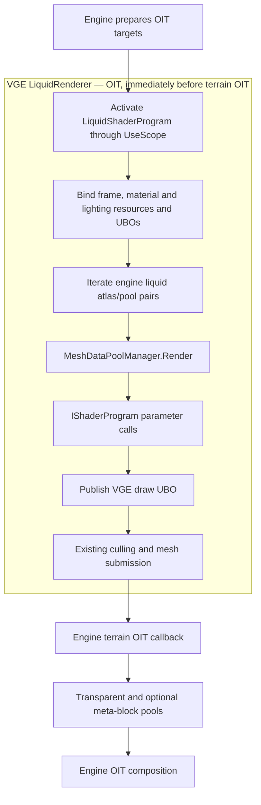

# VGE-owned liquid renderer proposal

## Intended result

VGE owns liquid shader programs, precompiled SPIR-V, UBOs and resource bindings. The engine continues to own chunk meshes, mesh-pool lifecycle, visibility/culling and OIT targets/composition. Glass and other transparent terrain retain their existing renderer.

The replacement retains the PBR material and lighting contract, but preserving legacy water fog or wave displacement is not a requirement. Do not port those implementations merely for visual parity. Waterline effects, volume scattering, modern wave displacement with a VGE-owned liquid-depth pass, refraction and scene reflections remain linked tasks in PBR.BaselineShading.todo.

## Rendering architecture

The installed engine registers one terrain OIT callback, `ret-oit`, at order 0.37. Its `ChunkRenderer.RenderOIT` draws liquids and then other transparent terrain. There is no independent liquid callback to unregister. A narrowly scoped Harmony patch therefore suppresses only its liquid shader setup and submission, preserving shared state setup and the remaining transparent draws.

The VGE renderer must explicitly establish and restore its required state; it cannot rely on setup performed later by the engine callback. The engine temporarily disables its SSBO mesh path for liquid submission today; the replacement must preserve that mesh-layout contract.

## Proposed code layout

| Owner                                                | Responsibility                                                                                                                                                                                           |
| ---------------------------------------------------- | -------------------------------------------------------------------------------------------------------------------------------------------------------------------------------------------------------- |
| `PBR/Liquids/LiquidRenderer.cs`                      | Own the OIT callback; obtain current engine atlas/pool pairs; coordinate program activation, resource binding and liquid submission.                                                                     |
| `PBR/Liquids/LiquidShaderProgram.cs`                 | Own the SPIR-V program and generated shader binding contracts through the existing `GpuProgram` infrastructure.                                                                                          |
| `PBR/Liquids/LiquidShaderProgram.EngineInterface.cs` | Explicitly implement the small `IShaderProgram` surface used by mesh pools, translating origin/transform writes into draw parameters. This is part of the program itself, not a separate shader wrapper. |
| `PBR/Liquids/LiquidFrameParamsUbo.cs`                | Own frame-stable camera, lighting, animation and optical inputs. Reuse established shared blocks where appropriate.                                                                                      |
| `PBR/Liquids/LiquidDrawParamsUbo.cs`                 | Own pool origin and per-draw transforms, including mini-dimension overrides and restoration.                                                                                                             |
| `HarmonyPatches/LiquidRenderHooks.cs`                | Suppress the validated engine liquid section only while VGE liquid rendering owns submission.                                                                                                            |
| Liquid shader assets/includes                        | Own vertex preparation, animated material sampling, optics and OIT output under the existing offline shader build system.                                                                                |

The mod-system composition root only constructs, registers and disposes the owner. It does not contain liquid rendering policy. Reuse existing material-atlas and atmosphere providers; do not duplicate their ownership inside the liquid renderer.

## Shared shader responsibilities

- Establish `includes/vertex_flags.glsl` as the shared definition and decoding utility for base-game vertex flags, including liquid flags. It must be usable by future terrain/entity shader replacements without liquid UBOs or varyings. Preserve distinct flag fields and their bit-layout contracts.
- Place reusable atlas addressing and texture-animation operations in `includes/texture_animation.glsl`. Keep liquid-specific flow speed, lava behavior and still-water blending policy in the liquid material helper; do not generalize those policies into every material.
- Place reusable climate/season colormap decoding and tint application in dedicated `includes/colormap_vertex.glsl` and `includes/colormap_fragment.glsl`. Supply their inputs through caller-owned bindings; do not couple them to liquid parameter names.
- Reuse existing PBR, color, atmosphere and shadow helpers. Extend `includes/oit.glsl` for liquid alpha and glow output instead of keeping a second OIT implementation.
- Do not retain copied legacy water-fog or wave/noise code solely to reproduce vanilla appearance. Select the replacement wave algorithm in the dedicated task; implement water absorption/in-scattering in the existing medium task. Fog spheres and perception effects are separate compatibility decisions, not reasons to retain legacy water fog.

The liquid-depth handoff replaces the shader/draw block using `chunkliquiddepth.vsh` with a VGE-owned SPIR-V pass while retaining the engine framebuffer and surrounding method operations. Both color and depth programs consume one Gerstner displacement include and one coherent parameter snapshot. Engine consumers retain the liquid-depth texture contract.

## Reusing engine mesh submission

`GpuProgram` already derives from the engine's `ShaderProgram`. Its `UseScope()` activates the managed shader owner as well as the GL program. The engine's `CurrentActiveShader` getter exposes that instance as `IShaderProgram`; direct assignment is unnecessary.

Mesh pools call `Uniform("origin", Vec3f)`. Mini-dimensions also query `HasUniform` and submit/restore matrices through `UniformMatrix`, with optional preview transparency. The installed base methods cannot be overridden, so the liquid program explicitly reimplements the relevant interface methods. It advertises the supported logical parameters even when their storage is a UBO rather than a standalone GLSL uniform.

Each write must publish the appropriate draw parameters before the following mesh draw. The adapter must use the established uniform-buffer upload/binding path, not merely change CPU data after a block has already been bound. Only pool-required calls are intercepted; unrelated interface behavior keeps its existing implementation.

## Compatibility and lifecycle

Preserve vertex attribute locations, packed liquid flags, animated texture selection, coordinate conventions and engine OIT attachment/blending contracts. Reuse shared engine helpers only where compatible with the offline SPIR-V build; isolate any owned compatibility definitions from optical shading.

Keep exactly one liquid submission owner. Prepare the replacement before enabling suppression. On setup failure, leave vanilla liquid submission enabled. Any supported runtime rollback must restore shader/GL state and release suppression coherently; it must not leave both paths active or suppress both. Full recovery from arbitrary GPU/context errors is not implied.

Use current engine pool/atlas references and the existing resource lifecycle across world changes, atlas additions and shader reloads. The renderer does not dispose engine meshes or OIT targets. Future refraction/reflection snapshots belong to existing screen-resource ownership and are allocated only when their consumers require them.

Remove `PbrLiquidShaderPatches` and liquid-specific engine shader injection once the owned renderer replaces that path. Atmospheric and material inputs then bind through the VGE program contract rather than the engine liquid program's setters.

## Checks before adoption

- Prove interface dispatch on the actual liquid program, including consecutive pool-origin updates, mini-dimension transforms and restoration, and preview transparency behavior.
- Verify draw-parameter uploads are visible to each submission with the existing uniform-ring lifecycle.
- Validate the suppression boundary and its interaction with existing terrain atlas hooks; preserve transparent/meta draws and matrix/GL state. Fail clearly if the installed engine layout changes.
- Compile/link the owned SPIR-V variants and test OIT outputs, material/lighting bindings, reload, atlas changes and ownership recovery through subagent-run tests.
- Obtain user-run visual acceptance for water/lava, moving liquid surfaces, mini-dimensions, underwater transitions and both PBR modes. Compare pass time and UBO/submission costs before claiming a performance improvement.

This proposal removes dependencies on vanilla shader-body variable names. Engine mesh formats, pool interface calls and OIT behavior remain explicit compatibility boundaries. The implementation and its validation status are tracked in [PBR.Liquids.md](PBR.Liquids.md).
